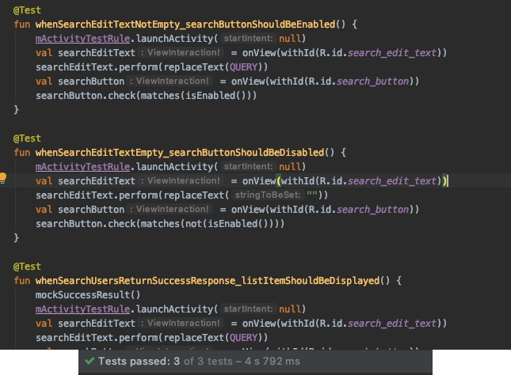

# GithubUserSearch
Github User Finder Application, data retrieved from github api: https://developer.github.com/v3/

Technology used :
- Paging with Paging 3 (Latest Android Jetpack)
- Dependency Injection with Hilt (Latest Android Jetpack)
- Cache using room database -> branch: cache_data_with_room (Experimental Android Jetpack)
- Network request with Retrofit
- Kotlin
- Coroutine

Architecture pattern:
- MVVM -> branch: master
- VIPER -> branch: viper

Tests:
- Unit Tests
- Intrumentated Tests

Screenshots:

Test Result:

